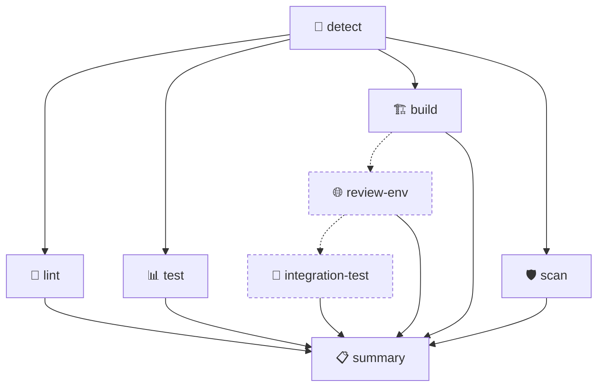

# 🥇 GoldenCI

**Golden-path CI for Go, Node, and Python.** Detect the language, lint it, test it behind a coverage gate, build it, scan it for vulnerabilities — in a few lines of YAML, zero secrets required.

[](https://github.com/marketplace/actions/goldenci)
[](https://github.com/goldenci/goldenci/actions/workflows/selfcheck.yml)
[](LICENSE)
[](.github/dependabot.yml)

## ✨ What is GoldenCI?

Most repos reinvent the same CI pipeline per language, by hand, forever slightly out of date. GoldenCI is that pipeline, built once, dogfooded on itself, and versioned like a real dependency: pin `@v1`, get patches and additive features for free, never a surprise breaking change.

One `uses:` line gets you: language auto-detection 🔎, lint 🧹, unit tests behind a static coverage gate 📊, a build step 🏗️, and SAST + dependency vulnerability scanning 🛡️ — each as its own re-runnable status check.

## 🧭 The pipeline



`detect`, `lint`, `test`, `build`, `scan` always run in parallel off one detection step. The dashed nodes, `review-env` → `integration-test`, are opt-in: they only run when `review-env: true` and you supply the commands. `summary` always runs last and never fails the build on its own.

## 🚀 Quickstart

```yaml
# .github/workflows/ci.yml
name: CI
on: [push, pull_request]

jobs:
  ci:
    uses: goldenci/goldenci/.github/workflows/golden-ci.yml@v1
    with:
      language: auto           # go | node | python | auto
      lint: true
      test: true
      coverage-threshold: 70
      build: true
      security-scan: true
```

That's the entire integration.

## 🚧 Hard gates

What actually fails a run:

| Gate | Fails when |
|---|---|
| 🧹 Lint | `golangci-lint` / `eslint` / `ruff check` exits non-zero (issue *count* is reported, never gates alone) |
| 📊 Unit tests | The test command exits non-zero |
| 📉 Coverage floor | Coverage < `coverage-threshold` (integration coverage is recorded, not gated) |
| 🛡️ SAST | Any CodeQL result resolving to `error` severity |
| 📦 Dependency vulns | `govulncheck` (Go) / `npm audit --audit-level=high` (Node) / `pip-audit` (Python) reports a finding |

## 🌐 Supported languages

| Language | Detected via | Lint | Coverage source |
|---|---|---|---|
| 🐹 `go` | `go.mod` | `golangci-lint` | `coverage.out` |
| 🟩 `node` | `package.json` | `eslint` | `coverage/coverage-summary.json` |
| 🐍 `python` | `pyproject.toml` / `requirements.txt` / `setup.py` / `setup.cfg` | `ruff check` | `coverage.xml` |

`language: auto` walks those marker files in order. If none match, and [`enry`](https://github.com/go-enry/enry) (installed via `fabasoad/setup-enry-action`) is available, the error names whatever language *was* found — so "this is Rust, not yet supported" beats a bare "couldn't detect anything." Toolchain versions read from the project when present (`go.mod`, `.nvmrc`/`engines.node`, `pyproject.toml`) and fall back to current stable otherwise; all three cache dependencies. A `Dockerfile` in `working-directory` opts the `build` job into an image build.

## ⚙️ Inputs (`golden-ci.yml`)

| Input | Default | Description |
|---|---|---|
| `language` | `auto` | `go \| node \| python \| auto` |
| `lint` / `test` / `build` | `true` | Toggle each job |
| `coverage-threshold` | `70` | Static coverage floor, percent |
| `security-scan` | `true` | SAST + dependency vulnerability scan |
| `review-env` | `false` | Deploy an ephemeral PR review environment |
| `working-directory` | `.` | Directory to operate in |
| `review-env-cmd` | `''` | Must print `url=<URL>` to `$GITHUB_OUTPUT` |
| `integration-test-cmd` | `''` | Receives `REVIEW_ENV_URL` in env |

Outputs mirror the jobs: `language`, `coverage-unit`, `coverage-integration`, `lint-issues`, `sast-findings`, `review-env-url`. The composite `action.yml` exposes the same shape minus `review-env` (see below).

## 🧩 Reusable workflow vs. composite action

Use **`golden-ci.yml`** (the primary surface) for a real PR check per stage (`ci / lint`, `ci / test`, …) and for `review-env`, which needs multiple jobs and so only exists here.

Use **`uses: goldenci/goldenci@v1`** as a single step when you want the whole golden path folded into a job you already control. Same inputs, all strings (booleans quoted: `'true'`/`'false'`), plus `setup-toolchain`.

## 🔒 Permissions & secrets

**Zero secrets, `permissions: contents: read`.** CodeQL runs with `upload: never` — no SARIF leaves the run, so no `security-events: write` either. Works the same on private repos.

## 📦 Versioning

- `@v1` — moving tag, patches + additive features automatically.
- `@v1.2.0` — frozen, byte-identical behavior.
- Within a major: additive only, never a removed/renamed input or changed default. Breaking changes ship as `@v2`; `v1` keeps working.
- Release steps (maintainers) are in [`CONTRIBUTING.md`](CONTRIBUTING.md#releasing-maintainers).

## 🧪 Examples

- [`examples/go-example/`](examples/go-example) — minimal Go module, 100% coverage
- [`examples/node-example/`](examples/node-example) — CommonJS + Jest + flat-config ESLint
- [`examples/python-example/`](examples/python-example) — `pyproject.toml` + `ruff` + `pytest`

All three are exercised end to end by this repo's own [`selfcheck.yml`](.github/workflows/selfcheck.yml) — the nested `ci.yml` inside each example is illustrative only (GitHub never reads workflows outside a repo's root `.github/workflows/`).

## 🛠️ Troubleshooting

**Coverage gate fails:**
```
coverage gate FAILED: unit coverage 68.0% is below the required 70%
```
Raise coverage or lower `coverage-threshold`.

**Language detection fails (exit 1):** no marker file matched — set `language:` explicitly. An invalid `language` value, or a `working-directory` that isn't a directory, exits 2 instead.

## 🚫 Non-goals

- No plugin/extensibility system — fork it if it doesn't fit.
- No monorepo orchestration — `working-directory` is a single subdirectory, not a matrix.
- No self-hosted runners in v1 — everything is `ubuntu-latest`.
- No release/deploy/post-merge steps — this is CI only.

## 🤝 Contributing

See [`CONTRIBUTING.md`](CONTRIBUTING.md). Everything here is dogfooded by [`selfcheck.yml`](.github/workflows/selfcheck.yml) — run it green before opening a PR, and pin any new third-party action to a commit SHA. Dependabot keeps existing pins current automatically.

Licensed under [Apache 2.0](LICENSE).
